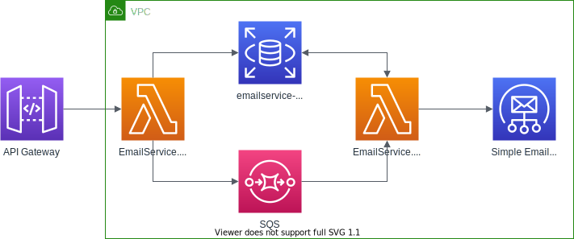

# Contents
- Diagrams and a high level proposal of the system design

- Lambda for API gateway used

- Lambda for SQS message processing

# API - A new Lambda-based emailer
Orders from clients need to email certain parties to notify them to approve and/or take action at certain intervals. This service provides a highly performant, scalable and cost effective system while allowing easy tracing of email sending statuses.

## Currently

These emails are sent via calling third party libraries within the same Web Application added years ago. It has tight coupling with data structures and workflows in the application, with small changes sometimes breaking entire builds or breaking the emailer.

A common issue exists with certain parties claiming that they received no email or the email was never sent to their system and it is time consuming to trace these changes and prove when these emails were sent.

## Overview of proposal
From the business' point of view, the requirement is to improve the reliability of emails in the main product. From the development point of view, having to fix bugs and rebuild the application adds unneccessary delays to the development cycle.

Hence the idea to split off the emailing sub-system into its own project while addressing these concerns was started.

### steps
Diagram for AWS resources

Diagram for API

Usage proposal.

Easily associate requests to their emails sent, and allow status checks of email statuses.

Coordinate with development and support teams to migrate old data into the new service and retire the previous emailer function.

